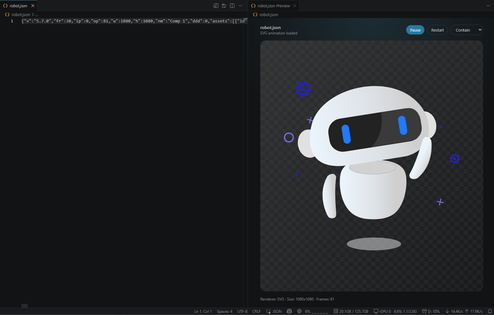
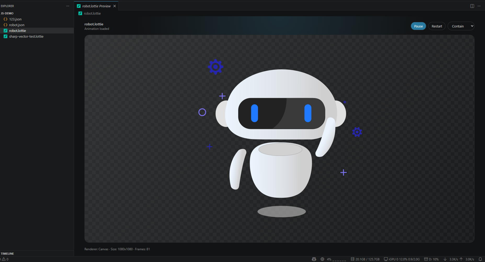

# lottie-toolkit

Preview Lottie animations directly in Visual Studio Code.

`lottie-toolkit` lets you inspect `.lottie` and Lottie `.json` animations without leaving the editor. It is built for designers, frontend developers, and anyone who needs to quickly check animation files while working in a project.

## Features

- Preview `.lottie` files directly in VS Code
- Preview Lottie `.json` files with sharp SVG rendering
- Automatically opens a linked preview beside Lottie JSON files
- Open referenced Lottie animations from HTML and Vue source files
- Closes the linked preview when the source JSON editor is closed
- Updates JSON previews from the current editor content, including unsaved edits
- Play, pause, and restart animations
- Change fit mode for `.lottie` previews
- Automatically reloads when animation files change on disk

## Preview `.lottie` Files

Open a `.lottie` file and it will display in the Lottie preview editor.

Use the controls in the preview toolbar to play, pause, restart, or adjust fit mode.

## Preview Lottie JSON Files

Open a Lottie `.json` file and the preview opens beside the editor automatically.

The preview is linked to the source JSON editor:

- Edit the JSON and the preview updates.
- Close the JSON editor and the preview closes.
- Switch away from the Lottie JSON file and the linked preview closes.

You can also open the preview manually from the editor title bar preview button.

## Preview From HTML And Vue

HTML and Vue files expose an `Open Lottie Preview` CodeLens and a `Preview Lottie` inline hint when the extension can resolve a local `.json` or `.lottie` animation.

Supported HTML patterns include:

- `<lottie-player src="./animation.json">`
- `<dotlottie-player src="./animation.lottie">`
- `lottie.loadAnimation({ container: document.getElementById('target'), path: './animation.json' })`
- `bodymovin.loadAnimation(...)`

Supported Vue single-file component patterns include:

- `container: lottieBox.value` paired with `
`
- `animationData` imported from local JSON, for example `import animationData from '@/assets/animation.json'`

In Vue files, Vue language tools may own the tag name click behavior. Click the resolved attribute value, such as `ref="lottieBox"`'s `lottieBox`, or use the CodeLens / inline hint to open the preview directly.

## Supported Files

- `.lottie`
- Lottie animation `.json`

Regular JSON files are ignored unless they match the Lottie animation structure.

## Rendering

- Lottie JSON files use SVG rendering for a sharper preview.
- `.lottie` files use the dotLottie renderer.

## Notes

Some advanced animation features may depend on support in the underlying Lottie renderer. If an animation does not display as expected, check whether the source file uses features supported by its renderer.
